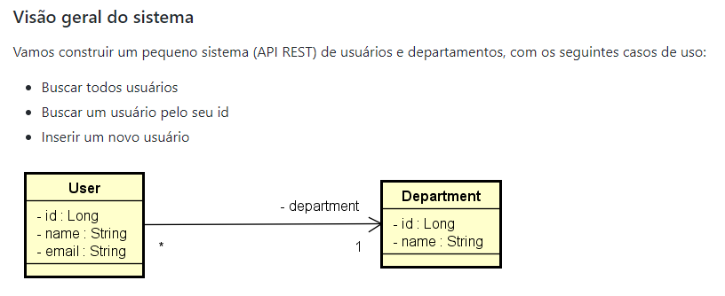
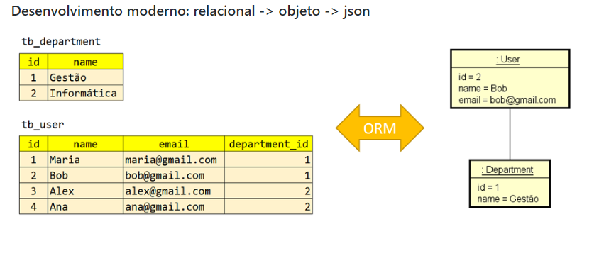
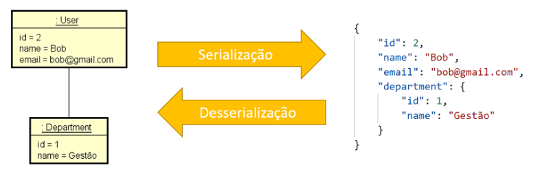
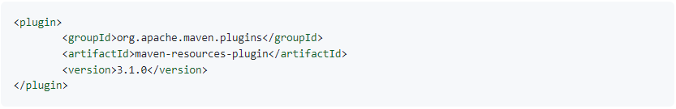
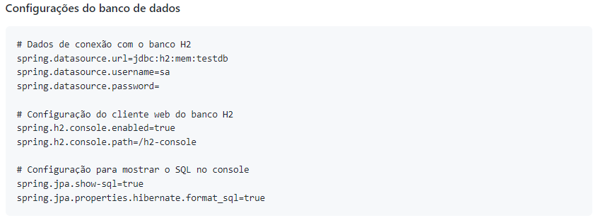
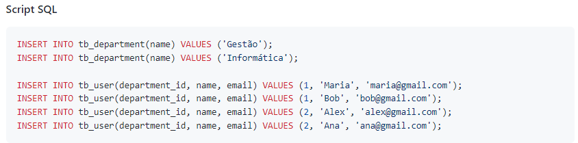

Projeto de REST API desenvolvido durante aula do Prof. Nélio Alves, da escola Dev Superior.

Trata-se de um modelo com duas entidades - usuário e departamento - onde
há uma relação de muitos usuários para um departamento.

Foram inicialmente implementados os endpoints para consulta e criação das entidades.

Por conta própria, estamos implementando:
- os endpoints de atualizar e apagar;
- validações;
- testes unitários;
- tratamento de exceções;
- DTO;
- Lombok;
- Swagger;

Passos:
- Criar o projeto
- Implementar o modelo de domínio
- Mapeamento objeto-relacional com JPA
- Configurar o banco de dados H2
- Criar os endpoints da API REST
- Trechos de código para copiar

